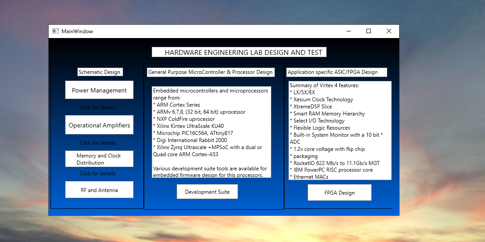
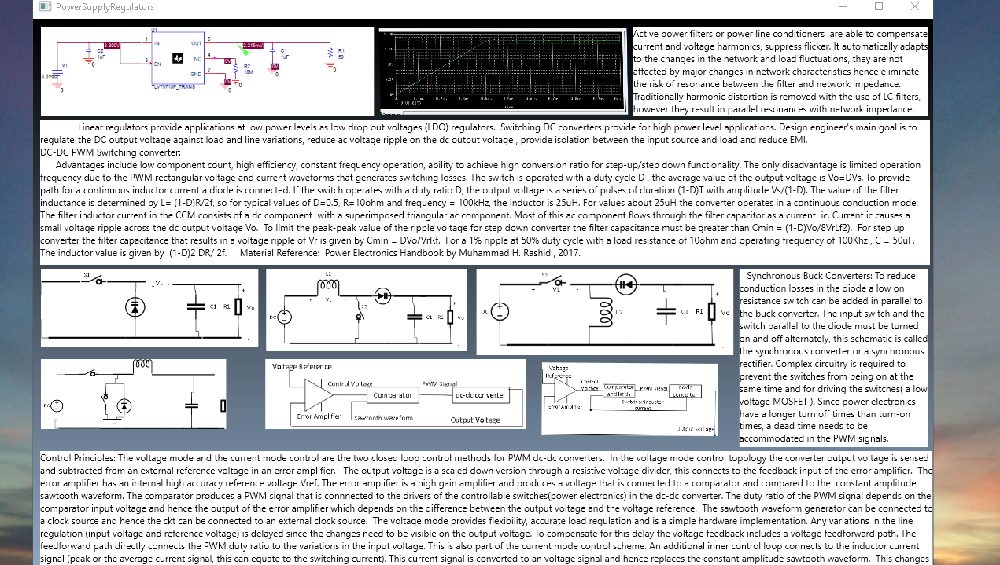
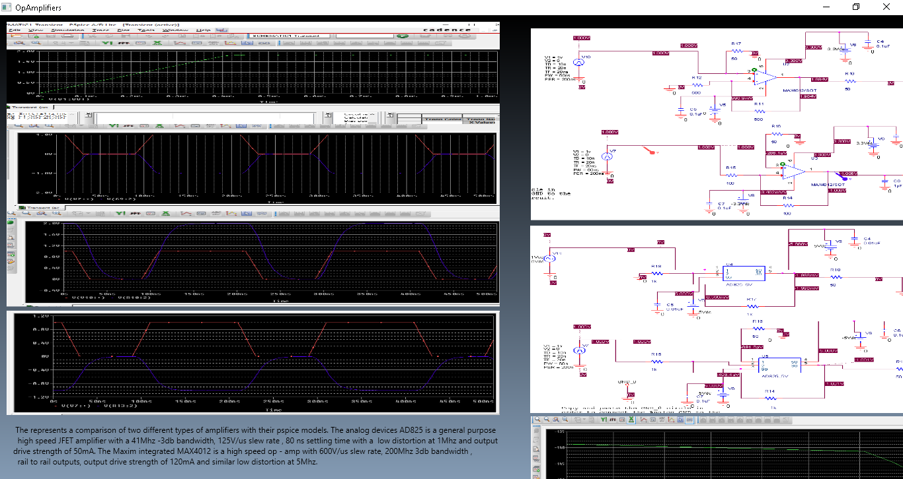
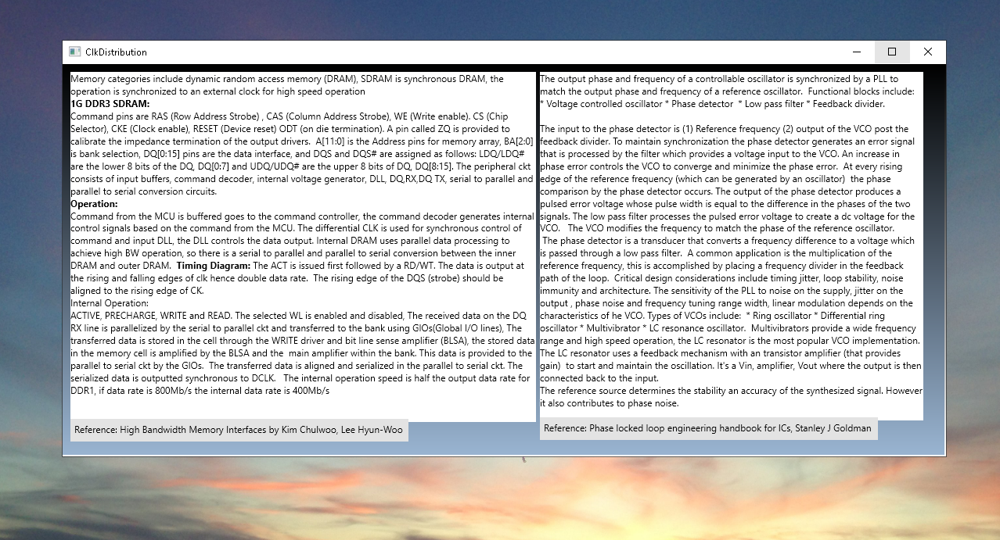
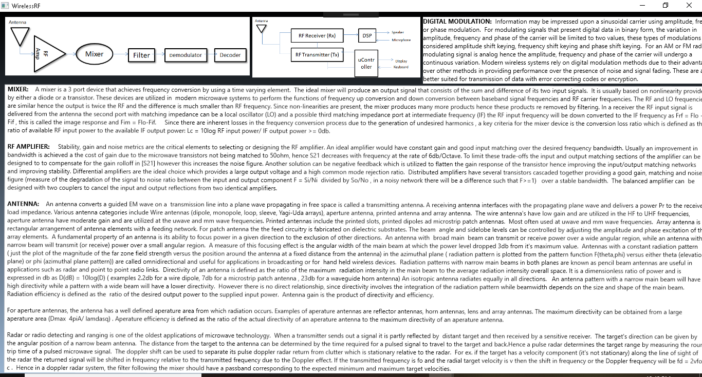
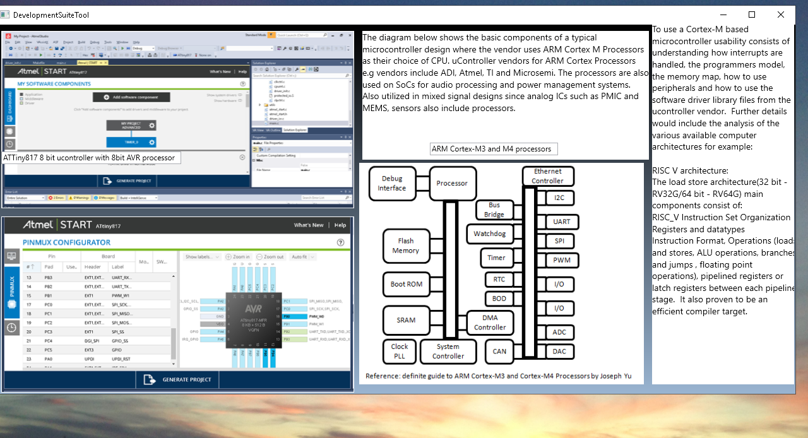
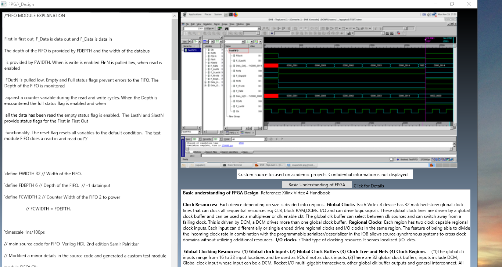
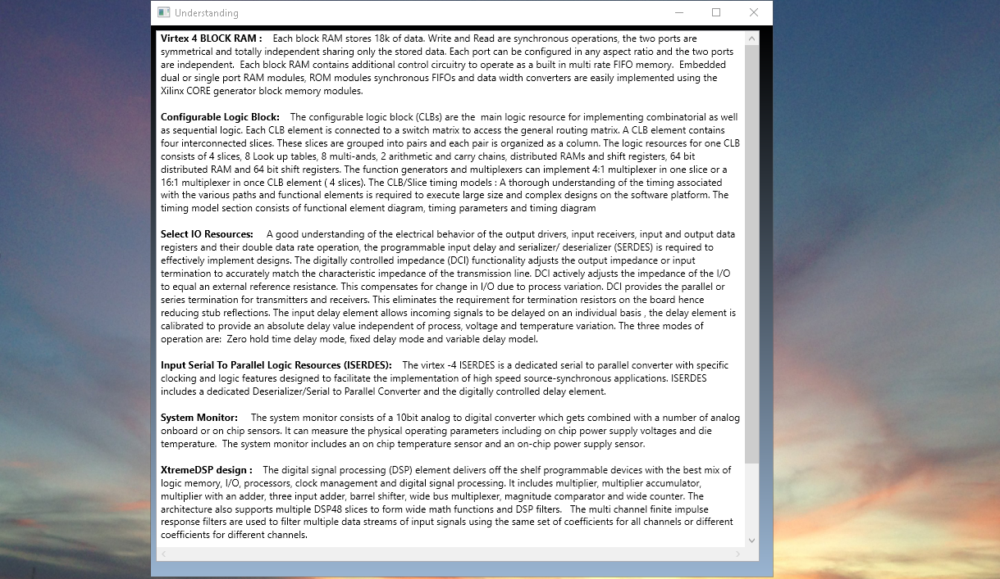
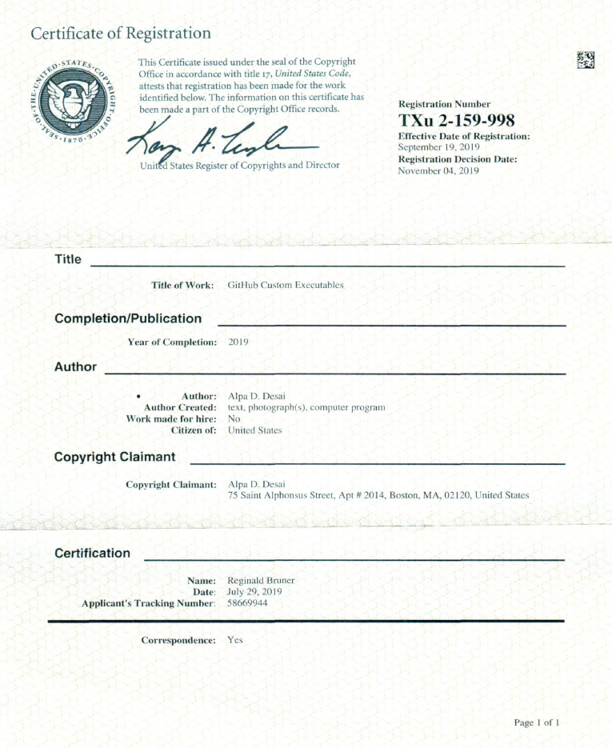

# Hardware Engineering Lab4+

The project provides an overview embedded systems in an engineering lab. Please download the executable in https://github.com/alpaddesai/HardwareEngineeringLab4-/releases for details. 
Company confidential information is not displayed. All images are either custom by Alpa D Desai or a reference name is included.Most of the images are custom. The project is United States Copyright Protected through the services of LegalZoom.

## Power Management

## Operational Amplifiers

## Memory and Clock Distribution

## RF 

## Development Suite
## Atmel iStudio 

## FPGA Design 

## Understanding Virtex 4

## Certificate of Registration

Further details reference: https://github.com/alpaddesai/EngineeringMathematics,  https://github.com/alpaddesai/SemiConductorSolidStateDevices ,  https://github.com/alpaddesai/PCBDesignProcess , https://github.com/alpaddesai/PowerDistributionNetworks ,  https://github.com/alpaddesai/PCBSignalIntegrity_EEM ,  https://github.com/alpaddesai/WirelessNetworkingProducts , https://github.com/alpaddesai/EmbeddedDesign ,  https://github.com/alpaddesai/FundamentalsComputerEngineering, https://github.com/alpaddesai/MedicalDevices, https://github.com/alpaddesai/IntroductionToMachineLanguageProgramming , https://github.com/alpaddesai/VerilogHDL, https://github.com/alpaddesai/DigitalLogicHDL, https://github.com/alpaddesai/Microarchitecture  and https://github.com/alpaddesai/ComputerArchitecture
